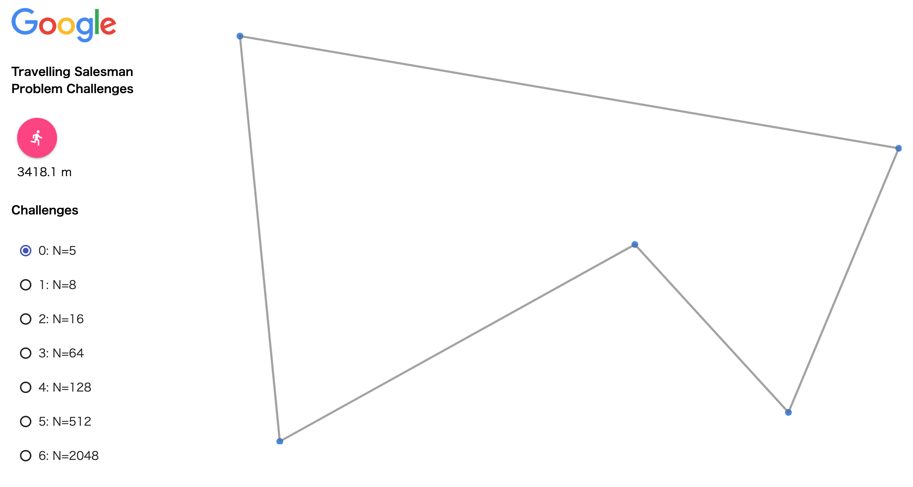
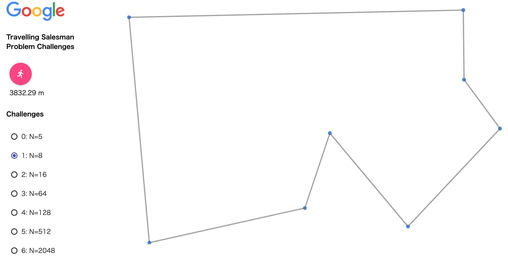
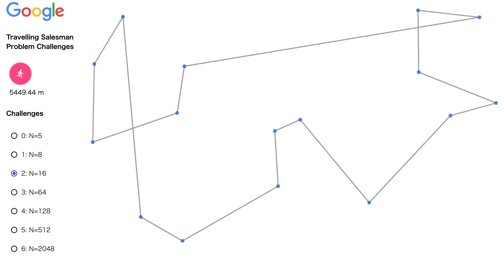
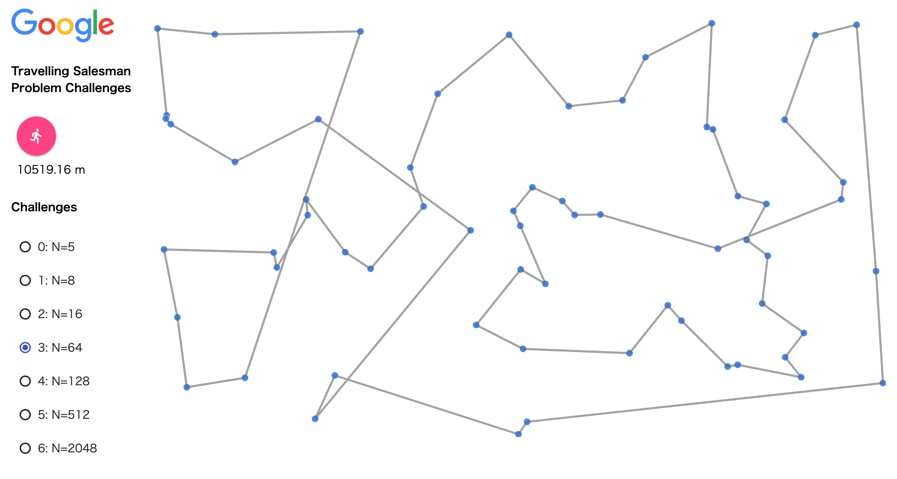
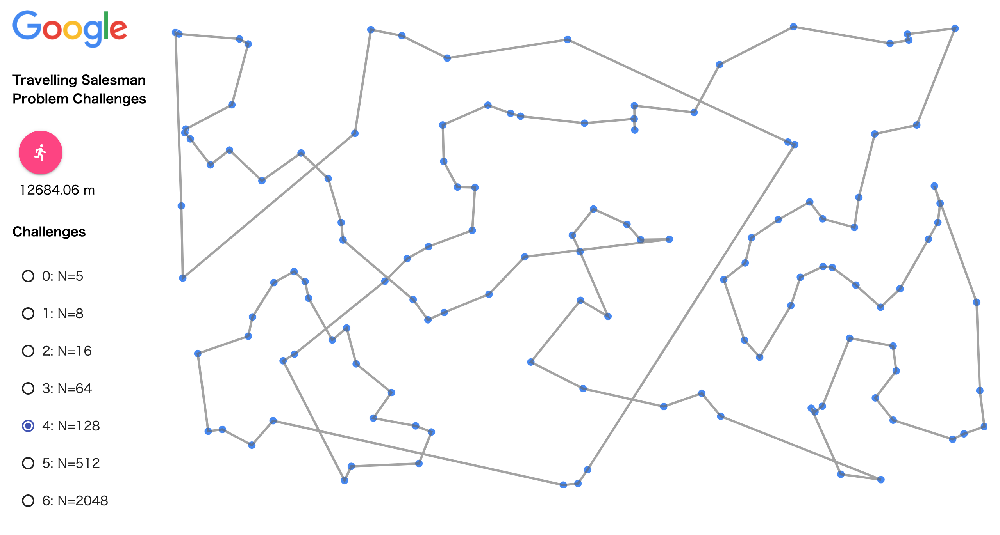
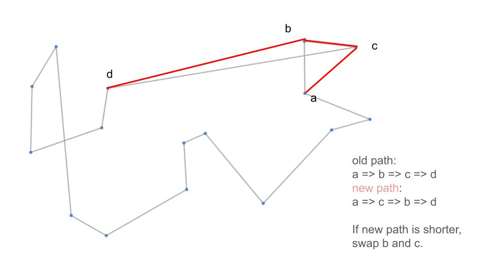
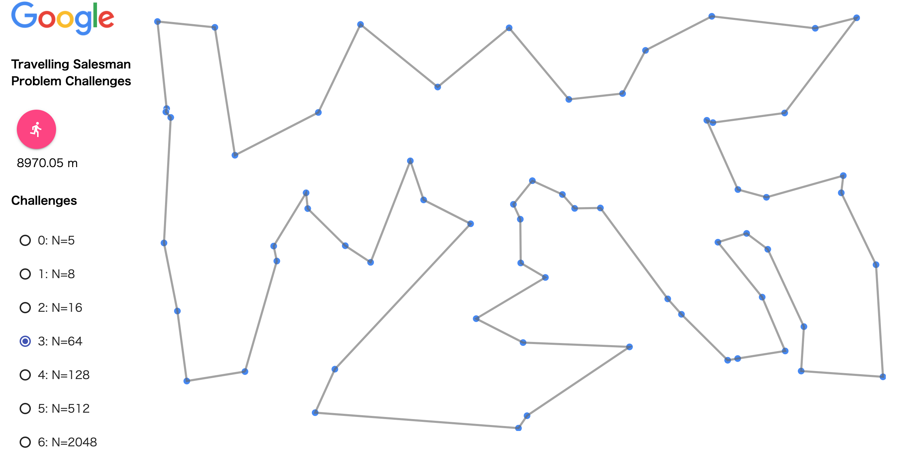

# Google STEP 2022: Travelling Salesman Problem Challenges
The problem instruction follows the Kurumi's documentation.

# Approaches
### 1. Greedy
### 2. 2-opt

# 1. Greedy
It visits the nearest point from the current point.

## Result
The greedy approach seemed to find the most optimal tour where n = 5 or n = 8. However, when N is 16 or more, the result tour does not look like very optimal. From the pictures below, it is clear that the more points there are, the more crosses in the tour.<br>
n = 5


n = 8


n = 16


n = 64


n = 128


## How to run
```shell
python3 solver_greedy.py input_{0~6}.csv >output_{0~6}.csv  
```
You can lauch a server and use a visualizer by following the instruction at `Problem Instruction` part.

# 2-opt
In order to resolve the crosses caused by the greedy approach, I implemented the 2-opt approach.

The 2-opt way is based on the tour generated by the greedy approach. It generates a new path with four points. The middle two points are swapped in the new path. If the new path is shorter than the old path, I swap the middle two points.


## Result
There aren't any crosses at all in all the challenges.
For examplw, in the challenge 3, the visualization looks like this.


Since the scores below is lower than other stundents' ones, I'm going to employ other approaches. At present, I'm going to employ or-opt and parallelization.
| Challenge   | Score (meters) |
| ----------- | -------------- |
| Challenge 0 | 3,418.10   |
| Challenge 1 | 3,832.29 |
| Challenge 2 | 4,994.89 |
| Challenge 3 | 8,970.00 |
| Challenge 4 | 11,489.79|
| Challenge 5 | 21,363.60|
| Challenge 6 | 42,712.37 |

## How to run
```shell
python3 solver_2-opt.py input_{0~6}.csv >output_{0~6}.csv  
```


# Problem Instruction

Originally By: [Hayato Ito](https://github.com/hayatoito) (hayato@google.com)  
2020-2022 Versions By: [Hugh O'Cinneide](https://github.com/hkocinneide)
(hughoc@google.com)

## Quick Links

- [Scoreboard]

[scoreboard]:
  https://docs.google.com/spreadsheets/d/18YQHRnnJ-p-PW9OVtXDRtMl02zha1MTEjXYz-cSNXyE/edit?usp=sharing
[github issues]: https://github.com/hayatoito/google-step-tsp/issues

## Problem Statement

In this assignment, you will design an algorithm to solve a fundamental problem
faced by every travelling salesperson, called _Travelling Salesman Problem_
(TSP). I’ll explain TSP in the onsite class. TSP is very famous problem. See
[Wikipedia](http://en.wikipedia.org/wiki/Travelling_salesman_problem). You can
understand the problem without any difficulties.

Quoted from
[Wikipedia](http://en.wikipedia.org/wiki/Travelling_salesman_problem):

> The travelling salesman problem (TSP) asks the following question: Given a
> list of cities and the distances between each pair of cities, what is the
> shortest possible route that visits each city exactly once and returns to the
> origin city?

## Assignment

The assignment is hosted on GitHub,
[https://github.com/hayatoito/google-step-tsp](https://github.com/hayatoito/google-step-tsp).

You can download the assignment by `git clone`:

```shellsession
git clone https://github.com/hayatoito/google-step-tsp
```

The repository includes sample scripts written in Python 3, rather than in
Python 2. It’s your responsibility to install Python 3 if you want to run the
scripts, though running the scripts is not mandatory.

There are 7 challenges of TSP in the assignment, from N = 5 to N = 2048:

| Challenge   | N (= the number of cities) | Input file  | Output file  |
| ----------- | -------------------------: | ----------- | ------------ |
| Challenge 0 |                          5 | input_0.csv | output_0.csv |
| Challenge 1 |                          8 | input_1.csv | output_1.csv |
| Challenge 2 |                         16 | input_2.csv | output_2.csv |
| Challenge 3 |                         64 | input_3.csv | output_3.csv |
| Challenge 4 |                        128 | input_4.csv | output_4.csv |
| Challenge 5 |                        512 | input_5.csv | output_5.csv |
| Challenge 6 |                       2048 | input_6.csv | output_6.csv |

See _Data Format Specification_ section to know the format of input and output
files.

### Your tasks

- Write a program, solving each TSP by designing and implementing an algorithm.
- Overwrite each output file, `output_{0-6}.csv`, with the output of your
  program.
- Enter the _path length_ of your output in the [scoreboard], for each
  challenge. Needless to say, a shorter path is better then a longer path.

### Visualizer

The demo page of the visualizer is
[here](https://hkocinneide.github.io/google-step-tsp/visualizer/build/default/).

The assignment includes a helper Web page,
`visualizer/build/default/index.html`, which visualizes your solutions. You need
to run a HTTP server on your local machine to access the visualizer. Any HTTP
server is okay. If you are not sure how to run a web server, use the following
command to run the HTTP server. Make sure that you are in the top directory of
the assignment before running the command.

```shellsession
python -m http.server # For Python 3
python -m SimpleHTTPServer 8000 # If you don’t want to install Python 3
```

Then, open a browser and navigate to the
[http://localhost:8000/visualizer/build/default/](http://localhost:8000/visualizer/build/default/).

Visualizer was only tested by Google Chrome. Using the visualizer is up-to you.
You don’t have to use the visualizer to finish the assignment. The visualizer is
provided for the purpose of helping you understand the problem.

See
[GitHub Help](https://help.github.com/articles/configuring-a-publishing-source-for-github-pages/)
to know how to enable GitHub pages on your repository.

## Data Format Specification

### Input Format

The input consists of `N + 1` lines. The first line is always `x,y`. It is
followed by `N` lines, each line represents an i-th city’s location, point
`xi,yi` where `xi`, `yi` is a floating point number.

```
x,y
x_0,y_0
x_1,y_1
…
x_N-1,y_N-1
```

### Output Format

Output has `N + 1` lines. The first line should be “index”. It is followed by
`N` lines, each line is the index of city, which represents the visitation
order.

```
index
v_0
v_1
v_2
…
v_N-1
```

### Example (Challenge 0, N = 5)

Input Example:

```
x,y
214.98279057984195,762.6903632435094
1222.0393903625825,229.56212316547953
792.6961393471055,404.5419583098643
1042.5487563564207,709.8510160219619
150.17533883877582,25.512728869805677
```

Output (Solution) Example:

```
index
0
2
3
1
4
```

These formats are requirements for the visualizer, which can take only properly
formatted CSV files as input.

## Schedule

### The class begins: 2022-06-03 (Fri) 6:40pm (JST)

I'll explain the "TSP" assignment.

Action items on Friday:

1.  Fill out your name in the first column of the [Scoreboard]:

2.  Fork this repository into your own GitHub.

### Coding: From: 2022-06-03 (Fri) 8:00pm - To: 2022-06-10 (Fri) 5:00pm

Until next Friday, you are expected to improve your algorithm and enter
the score in the [scoreboard] manually for each challenge. You can update the
score as many times as needed. I highly recommend you to update your score
whenever you can find a shorter path.

Feel free to submit, or continue working on this assignment past next Friday. I
will go over the results in class next week, so if you want to show off how well
you did on the leaderboard, submit by classtime!

## What’s included in the assignment

To help you understand the problem, there are some sample scripts / resources in
the assignment, including, but not limited to:

- `solver_random.py` - Sample stupid solver. You never lose to this stupid one.
- `sample/random_{0-6}.csv` - Sample output files by solver_random.py.
- `solver_greedy.py` - Sample solver using the greedy algorithm. You should beat
  this definitely.
- `sample/greedy_{0-6}.csv` - Sample output files by solver_greedy.py.
- `sample/sa_{0-6}.csv` - Yet another sample output files. I expect all of you
  will beat this one too. The solver itself is not included intentionally.
- `output_{0-6}.csv` - You should overwrite these files with your program's
  output.
- `output_verifier.py` - Try to validate your output files and print the path
  length.
- `input_generator.py` - Python script which was used to create input files,
  `input_{0-6}.csv`
- `visualizer/` - The directory for visualizer.

Details are intentionally omitted here. It is your responsibility to understand
the contents of the repository.

## Code of Conduct

- Since we are competing for the best algorithm, please do not cheat:
- You can get an assistance only from other STEP students, mentors, or
  lecturers..
- Don't get any assistance from any other people (e.g. your friends, professors,
  etc).
- Use your best judgment when using third party libraries. If it will be
  non-trivial for a reviewer to understand the library, it may be doing too
  much work that you could be learning from.
- It is okay to use built-in libraries provided by programming languages, of
  course.

## Tips for Development

The following tips might be helpful:

- Commit often, and push often. Small commits are easy to review, and are
  unlikely to conflict others' changes.

- Your code should be consistency well formatted. Please make sure to use
  appropriate code formatter, if you are not in confident. Don't try to format
  your code by yourself if a tool can do that.

## FAQ

This FAQ includes the questions and the answers in the past years, as is. Some
Q/A might be obsolete for this year.

- Q. I found a typo in this document.

- A. Please feel free to send a
  [pull request](https://help.github.com/articles/using-pull-requests/), as a
  practice, or file an issue at [GitHub Issues] if you are not confident using
  git.

- Q. Do I have to use the same code for every challenge?

- A. No.

- Q. Is there any limitation of machine resources I can use? Can I use multiple
  machines? Can I run my algorithm 24 hours?

- A. No limitation at all. You can use any machine resources you have.

- Q. It seems that this document and the scoreboard are publicly viewable. Is
  this intentional?

- A. Yes. I am a fan of transparency. If you have any concerns, please let me
  know that. I’ll honor your preference. Don’t enter any confidential
  information.

- Q. Can I look other student's repository?

- A. Yes. Don't try to hide anything. Eveything should be open. It's fine to
  exchange ideas between students, or borrow their ideas.

## Acknowledgments

This assignment is heavily inspired by
[Discrete Optimization Course on Coursera](https://www.coursera.org/learn/discrete-optimization).

